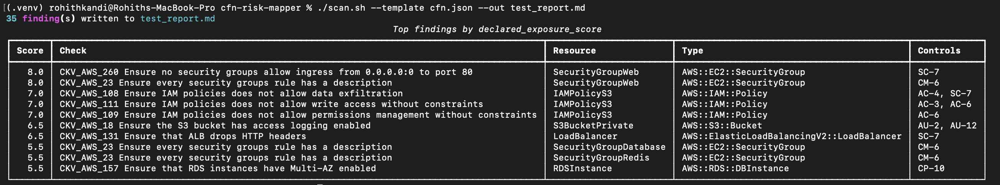

<div align="center">

# cfn-risk-mapper

**Prioritizes CloudFormation security findings by declared exposure, and maps them to NIST 800-53 controls.**

[](LICENSE)
[](pyproject.toml)
[](https://www.checkov.io/)
[](#what-this-is-not)

</div>

---

Checkov and similar scanners flag every misconfiguration with equal visual weight. A
scan can return 50+ findings with no sense of which ones actually matter given how
resources connect to each other. `cfn-risk-mapper` adds a synthesis layer on top of
Checkov's detection: it builds a graph of how resources in your template reference
each other, scores each finding by how exposed that resource is *within the
template*, and groups the results by the NIST 800-53 control family they map to.

## Contents

- [How it works](#how-it-works)
- [Example output](#example-output)
- [What this is not](#what-this-is-not)
- [Status](#status)
- [Requirements](#requirements)
- [Setup](#setup)
- [Usage](#usage)
- [CI gating](#ci-gating)
- [License](#license)

## How it works

A `scan` run pushes a template through five stages:

| Stage | Module | What it does |
|---|---|---|
| 1. Detect | `detector.py` | Shells out to `checkov -f <template> -o json`; never reimplements its rules |
| 2. Graph | `graph_builder.py` | Parses `Ref`/`Fn::GetAtt`/`Fn::Sub`/`DependsOn` into a networkx graph of declared relationships |
| 3. Score | `scorer.py` | Combines resource criticality, graph fan-in/out, and property-level red flags into a `declared_exposure_score` |
| 4. Map | `compliance_mapper.py` | Looks up each Checkov check ID against a hand-verified NIST 800-53 table |
| 5. Report | `report_generator.py` | Renders one Markdown file, grouped by control family, ranked by score |

## Example output

Terminal output from a `scan` run against a larger, real-world multi-tier template
(ALB, security groups, IAM policies, RDS) -- the top 10 findings by
`declared_exposure_score`, printed alongside the full Markdown report:



The Markdown report itself groups every finding (not just the top 10) by NIST
control family. Running `scan` against `fixtures/sample.json` (a wildcard IAM role, a
public S3 bucket, and a Lambda that references both) produces:

```markdown
# cfn-risk-mapper Report
Template scanned: `fixtures/sample.json`
Total findings: 18

> declared_exposure_score reflects only what is declared in the given
> template(s) -- not live AWS state. It is not a blast-radius measurement.

## AC -- Access Control

| Score | Check                                          | Resource   | Type            | Controls   |
|------:|-------------------------------------------------|------------|-----------------|------------|
|   8.5 | CKV_AWS_108 IAM policy allows data exfiltration | BroadRole  | AWS::IAM::Role  | AC-4, SC-7 |
|   8.5 | CKV_AWS_63  Wildcard "*" statement actions       | BroadRole  | AWS::IAM::Role  | AC-6       |
|   7.0 | CKV_AWS_20  S3 bucket allows public READ         | DataBucket | AWS::S3::Bucket | AC-3       |
```

The wildcarded IAM role ranks highest, the public bucket next, and a Lambda that
merely *references* both (with no exposure signals of its own) ranks lowest --
exactly the triage signal a flat Checkov scan doesn't give you.

## What this is not

- **Not a scanner.** It never reimplements CloudFormation security rule detection --
  it always shells out to Checkov for that.
- **Not a blast-radius calculator.** The `declared_exposure_score` is computed only
  from what's declared in the template(s) given (`Ref`, `Fn::GetAtt`, `DependsOn`,
  `Fn::Sub` interpolation) -- not live AWS state.
- **Not connected to your AWS account.** No credentials, no live account access. Pure
  static analysis.

## Status

Early development. Accepts both CloudFormation **JSON and YAML** (short-form
intrinsics like `!Ref`/`!GetAtt` included, normalized via `cfn-flip`), and can scan
either a single template or a whole directory of them. See [CLAUDE.md](CLAUDE.md) for
the full architecture and scope decisions.

## Requirements

- Python 3.14+
- [Checkov](https://www.checkov.io/) installed and on your `PATH`

Checkov is a separate CLI dependency, not a Python package of this project -- it pins
an old `networkx` that conflicts with the modern API `graph_builder.py` relies on.
Install it in its own isolated environment with [pipx](https://pipx.pypa.io/):

```bash
pipx install checkov
```

## Setup

```bash
python3 -m venv .venv
source .venv/bin/activate
pip install -e ".[dev]"
```

## Usage

```bash
./scan.sh --template path/to/template.json --out report.md
```

Or scan every template (JSON or YAML) in a directory, recursively, aggregated into
one report:

```bash
./scan.sh --template-dir path/to/infra/ --out report.md
```

Each template found is scanned **independently** -- its own dependency graph, its own
scores. This does not resolve `Fn::ImportValue` references between stacks; that
cross-stack resolution remains a stretch goal (see CLAUDE.md).

## CI gating

Pass `--fail-on-score` to make `scan` exit non-zero when any finding's
`declared_exposure_score` meets or exceeds the given value -- the full report is
still written either way. This is what lets a CI pipeline actually block a PR on
highly-exposed findings, instead of just producing a report someone has to
remember to go read:

```bash
./scan.sh --template path/to/template.json --out report.md --fail-on-score 7
```

<details>
<summary>Minimal GitHub Actions step</summary>

```yaml
- name: Install cfn-risk-mapper and Checkov
  run: |
    pipx install checkov
    pip install -e ".[dev]"
- name: Scan CloudFormation template
  run: ./scan.sh --template infra/template.json --out cfn-risk-report.md --fail-on-score 7
- name: Upload report
  if: always()
  uses: actions/upload-artifact@v4
  with:
    name: cfn-risk-report
    path: cfn-risk-report.md
```

</details>

Remaining v1 scope limit: no cross-stack `Fn::ImportValue` resolution when scanning
a directory -- each template's exposure score reflects only its own declared
relationships, not references into or out of sibling stacks.

## License

[MIT](LICENSE)
